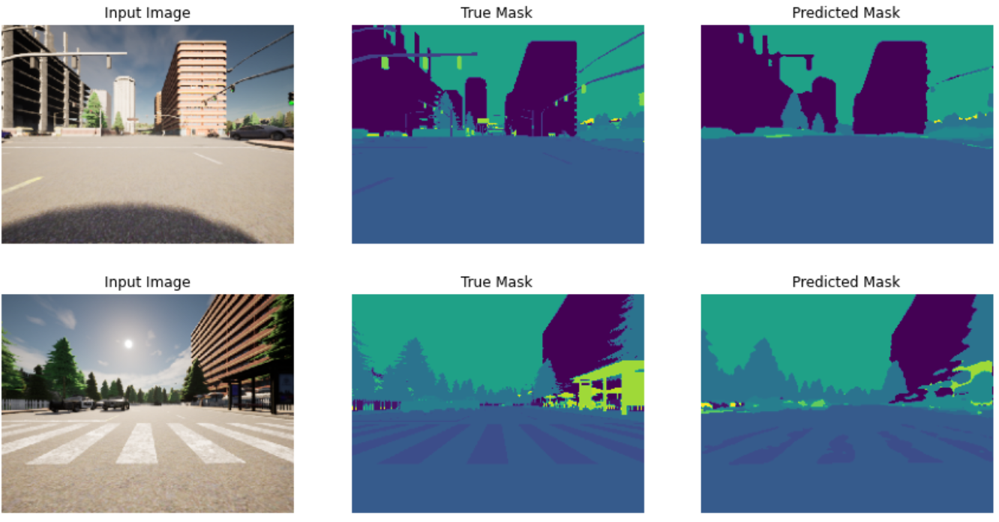

# 🏙️ UNet for Semantic Segmentation of Urban Scenes

<p align="center">
  
  
  
  

</p>

### About

This project implements a UNet model for performing high-precision semantic segmentation on urban road scenes captured by self-driving car cameras.

---

## 📝 Project Description

Semantic segmentation is a critical task in computer vision, particularly in the context of autonomous driving. This project focuses on developing a UNet-based model capable of accurately identifying and classifying each pixel in a road scene image. The goal is to segment various elements such as roads, cars, pedestrians, and buildings, contributing to a machine's understanding of its environment.

### 🎯 Objectives

- **Model**: Implement a UNet architecture for semantic segmentation.
- **Task**: Classify each pixel in high-resolution images into one of 19 object classes.
- **Application**: Enhance the safety and navigation of self-driving cars through precise environmental perception.

---

## 🛠️ Prerequisites

Ensure that you have the following dependencies installed before running the project:

- **Python 3.6+**: The programming language used for the project.
- **PyTorch**: The deep learning framework employed for building and training the UNet model.
- **Pandas**: For data manipulation and analysis.
- **NumPy**: For numerical operations, particularly with arrays and matrices.

You can install the required libraries via pip:

```bash
pip install torch pandas numpy
```

---

## 🌆 Dataset: Cityscapes

<p align="center">
  
</p>

The **Cityscapes Dataset** is a large-scale benchmark dataset used for training and evaluating models for semantic urban scene understanding. 

### Dataset Overview

- **Total Images**: 5,000 high-resolution images
- **Resolution**: 2048x1024 pixels per image
- **Classes**: 19 object classes, including roads, cars, pedestrians, buildings, and more
- **Annotations**: High-quality pixel-level annotations

### Why Cityscapes?

Cityscapes provides a rich, diverse set of urban scenes that are crucial for developing robust models for autonomous driving. The detailed pixel-level annotations allow the UNet model to learn fine-grained distinctions between different objects in complex urban environments.

<p align="center">
  
</p>

---

## ⚙️ Model Architecture: UNet

UNet is a powerful convolutional network designed for semantic segmentation tasks. It excels at accurately segmenting images, even when the training data is limited. The architecture is characterized by its encoder-decoder structure:

- **Encoder**: Captures the context of the input image through a series of convolutional and max-pooling layers.
- **Decoder**: Reconstructs the spatial resolution using up-convolutional layers, allowing the model to predict the segmentation mask for each pixel.

### Training

- **Optimization**: The model is trained using the Cityscapes dataset, focusing on learning the complex urban scene structures.
- **Loss Function**: A combination of cross-entropy loss and dice loss is used to optimize pixel-wise predictions.
- **Evaluation**: The model's performance is evaluated using metrics such as Intersection over Union (IoU) and pixel accuracy.

---

## 🖼️ Results

The UNet model delivers high-quality segmentation outputs, distinguishing between various elements of urban scenes with remarkable precision.

<p align="left">
  
</p>
